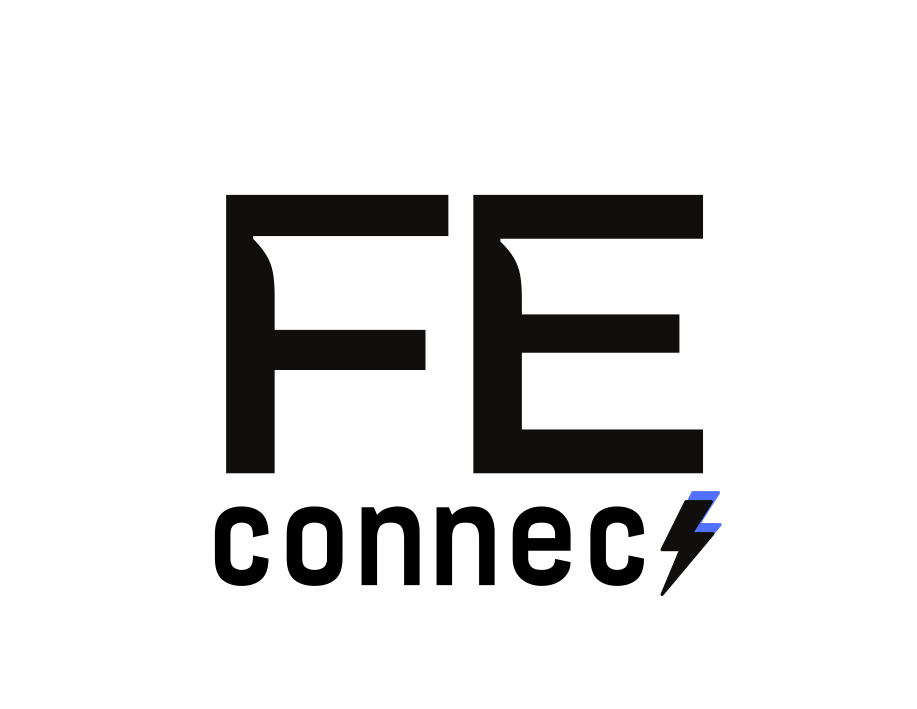

# FE Connect - Inovação na conexão.



Este projeto tem como objetivo atrair público para a Fórmula E, fornecendo uma interface interativa para visualizar e filtrar equipes de automobilismo. Os usuários podem ver suas equipes favoritas e suas respectivas posições, incentivando o engajamento com este emocionante esporte.

## Deploy
Em breve...

## Componentes do Projeto

### Estrutura

O projeto é estruturado em componentes principais:

- **Cabeçalho**: Exibe o título do projeto e informações relevantes sobre a Fórmula E.
- **Conteúdo**: A seção principal onde as equipes são exibidas.
  - **Grid de Equipes**: As equipes são apresentadas em um layout de grade (grid) que se adapta a diferentes dispositivos, exibindo até quatro equipes por linha em telas maiores.
  - **Operação Matemática**: A média das posições das equipes filtradas é calculada e exibida na parte superior do conteúdo. Esta funcionalidade permite que os usuários vejam rapidamente o desempenho médio das equipes exibidas.
- **Footer**: Contém informações sobre direitos reservados.

### Responsividade

O layout do projeto é totalmente responsivo, utilizando classes do Tailwind CSS para garantir uma boa experiência de usuário em dispositivos móveis, tablets e desktops. O grid se ajusta automaticamente para exibir uma quantidade adequada de equipes por linha dependendo do tamanho da tela.

## Equipe de Desenvolvimento

Este projeto foi desenvolvido por:

- **Erick Fujita** [RM556096]
- **Fabiano Zague** [555524]
- **João Vitor Boht** [558690]
- **Matheus Condez** [556954]
- **Pedro Certo** [556268]

## Tecnologias Utilizadas

- React.js
- Tailwind CSS
- LocalStorage para gerenciamento de favoritos

## Como Executar o Projeto

1. Clone o repositório:
   ```bash
    git clone https://github.com/BuildUrFuture/fe-connect.git
    cd fe-connect
    ```
2. Instale as dependências
    ```bash
    npm install
    ```
3. Inicie o servidor de desenvolvimento:
    ```bash
    npm run dev
    ```

# Contribuições
Contribuições são bem-vindas! Se você deseja contribuir para o projeto, sinta-se à vontade para abrir um pull request ou relatar problemas.